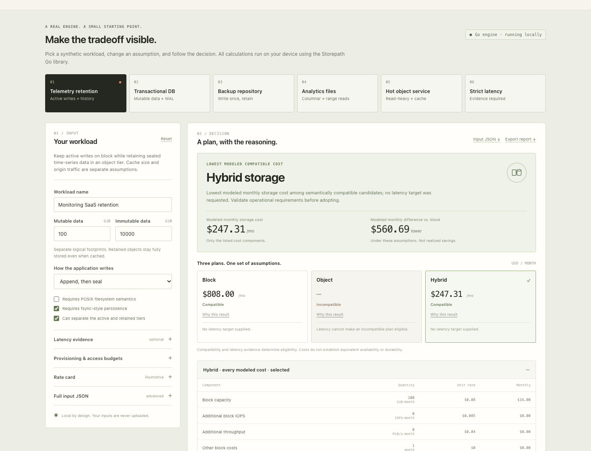

# Storepath

> **Deprecated — development has moved to [BlockOrBucket](https://github.com/spfuzzylink/blockorbucket).**
>
> BlockOrBucket now contains the standalone Go library, native CLI, and offline browser demo. Use it for new integrations. Storepath's published tags, imports, binaries, and release downloads remain available; no existing release has been rewritten or removed.
>
> **[Try BlockOrBucket](https://spfuzzylink.github.io/blockorbucket/)** · **[Go library and downloads](https://github.com/spfuzzylink/blockorbucket)** · **[Migration guide](https://github.com/spfuzzylink/blockorbucket/blob/main/docs/migration.md)**

The documentation below describes the retained Storepath release. Active development happens in BlockOrBucket.

## Choose where your data belongs.

**Compare block, object, and hybrid storage—and see the assumptions behind the decision.**

Storepath helps platform engineers turn a storage design question into a concrete comparison. Start with a workload, adjust capacity and access patterns, and inspect compatible options, monthly cost components, and missing latency evidence before provisioning anything.

**[Open the interactive demo →](https://spfuzzylink.github.io/storepath/)** · **[Download the offline demo](https://github.com/spfuzzylink/storepath/releases/download/v0.2.0/storepath-demo.html)** · [Get the CLI](https://github.com/spfuzzylink/storepath/releases/tag/v0.2.0)

The browser demo runs the same Go evaluator as the library and CLI, compiled to WebAssembly. Download one HTML file and open it in a modern browser. No installation, server, cloud account, or credentials are needed. Evaluation stays on your device.

[](https://spfuzzylink.github.io/storepath/)

## A storage decision you can explain in 60 seconds

Open the demo with **Telemetry retention**, then explore the default scenario:

| Candidate | What it means | Modeled monthly cost |
| --- | --- | ---: |
| Block | Keep 100 GiB of mutable state and 10,000 GiB of retained data on block storage. | $808.00 |
| Object | Use direct object APIs for an application that requires synchronous mutable writes. | Incompatible |
| Hybrid | Keep mutable state and a 100 GiB cache on block; retain sealed data in object storage. | $247.31 |

The **$560.69 modeled monthly difference** comes from the supplied synthetic rates and workload—not a customer savings claim or a complete TCO comparison.

1. Change retention or request volume and inspect how the comparison changes.
2. Review the cost breakdown and the reason each option qualifies or fails.
3. Try **Strict latency** to see why a price alone cannot satisfy a p99 target.
4. Export a report to bring the inputs and decision into a design discussion.

## Built for the questions behind the bill

- **“Can this database use object storage?”** Check the write and filesystem contract before comparing capacity prices.
- **“Where should our metrics history live?”** Model mutable ingestion separately from sealed retention and cache capacity.
- **“Why are cheap objects expensive to serve?”** Include operation counts and explicit post-cache traffic.
- **“Will the cheaper plan meet our latency target?”** Require supplied measurements instead of guessing performance from a storage label.

### Real applications, ready to explore

| Team and customer need | Design question to explore | Default result |
| --- | --- | --- |
| **SaaS database team:** persist customer transactions | Can [in-place writes and synchronous WAL persistence](examples/transactional-db.json) use direct object APIs? | Block |
| **Monitoring platform:** retain customer metrics for historical incident queries | Can [mutable ingestion and sealed history](examples/telemetry-retention.json) live on different tiers? | Hybrid |
| **Backup product:** retain recoverable customer snapshots | How do [immutable capacity and restore traffic](examples/backup-repository.json) affect the storage estimate? | Object |
| **Analytics platform:** query selected columns or ranges in large files | Do [selective reads](examples/analytics-range-reads.json) require block storage, and what does request fan-out cost? | Object |
| **File delivery service:** serve frequently requested immutable files | Does [caching hot data](examples/hot-object-service.json) justify its capacity and serving cost under supplied origin traffic? | Hybrid |
| **Latency-sensitive API:** meet a customer-facing response-time budget | What [p99 evidence](examples/strict-latency.json) is still missing before a plan qualifies? | Benchmark required |

These are illustrative customer problems, not customer case studies. Read the [use-case guide](docs/use-cases.md) for the assumptions and measurements to take next.

### Kubernetes and AI infrastructure

**Kubernetes platforms:** review a StatefulSet database's filesystem and WAL needs, separate an observability service's mutable ingestion from retained objects, or budget application backups before choosing a storage design. Start with the database, telemetry, and backup presets.

**AI platforms:** compare object-native training datasets, sealed model checkpoints, and a cache for frequently accessed model artifacts. Start with analytics, backup, and hot-object presets; supply your actual request fan-out, cache-origin traffic, and latency measurements.

The [Kubernetes and AI workflow guide](docs/use-cases.md#kubernetes-and-ai-infrastructure-workflows) maps each problem to an existing scenario and the next measurements to take. These are design reviews: CSI configuration, distributed filesystems, checkpoint correctness, GPU utilization, and training throughput require separate validation.

## Where Storepath fits in your workflow

Use Storepath when the decision is still **which storage design fits this application's data contract**. Its focused model puts write semantics, mutable/immutable placement, explicit request traffic, cost line items, and supplied latency evidence in one local comparison.

| Tool | Choose it for | How it fits with Storepath |
| --- | --- | --- |
| **Storepath** | Explore block, object, or hybrid placement before provisioning, with editable workload assumptions. | Compare compatible candidates, export the reasoning, and identify what needs a benchmark. |
| [AWS Pricing Calculator](https://aws.amazon.com/aws-cost-management/aws-pricing-calculator/) | Estimate AWS workload costs, including changes to existing workloads and applicable discounts or commitments. | Price the chosen AWS architecture in its deployment and purchasing context. |
| [Infracost](https://www.infracost.io/docs/) | Review cloud cost estimates and policy issues alongside infrastructure code and pull requests. | Track the cost impact as the selected design becomes infrastructure code. |
| [S3 Storage Lens](https://docs.aws.amazon.com/AmazonS3/latest/userguide/storage_lens.html) | Inspect actual S3 storage usage and activity, with cost-optimization and data-protection insights. | Use observed production behavior to revisit assumptions and refine the next design decision. |

Storepath complements provider pricing, infrastructure cost review, and production analytics. It supplies no live price catalog, billing integration, IaC analysis, production telemetry collection, or performance measurements. Its value is a small, inspectable design experiment you can run immediately and bring to a review.

## One evaluator. Three ways to use it.

**Browser:** [open the demo](https://spfuzzylink.github.io/storepath/) or [download the self-contained HTML](https://github.com/spfuzzylink/storepath/releases/download/v0.2.0/storepath-demo.html) for an offline walkthrough. Edit a preset and export its report.

**CLI:** run repeatable comparisons on macOS or Linux without installing Go:

```sh
git clone https://github.com/spfuzzylink/storepath.git
cd storepath
sh scripts/install.sh
bin/storepath demo
```

```sh
bin/storepath evaluate examples/telemetry-retention.json
bin/storepath demo --json
```

The installer downloads the pinned release and verifies its SHA-256 checksum. `evaluate` returns structured JSON. [Installation instructions](docs/installation.md) cover direct archive downloads and source builds.

**Go library:** add the evaluator to your own design tooling:

```sh
go get github.com/spfuzzylink/storepath@v0.2.0
```

```go
decision, err := storepath.Evaluate(input)
```

`input` is a `storepath.Input` containing a schema version, workload, and rate card. The library returns a structured decision or a validation error. See the [runnable library example](examples/library/main.go), [complete input fixtures](examples), and [API architecture](docs/architecture.md).

## Why the recommendation is inspectable

**The application contract comes first.** Direct object storage is rejected when the declared workload needs POSIX, fsync, random in-place updates, or an unsealed append stream. A separable mutable/immutable design can qualify for hybrid placement.

**Costs are itemized.** Capacity, provisioned block IOPS and throughput, object operations, retrieval, egress, and explicit additional monthly costs remain visible. A cache adds capacity; it does not erase the retained object copy. Origin traffic is supplied explicitly, not inferred from cache size.

**Latency stays evidence-based.** A p99 target needs a supplied, passing measurement for an eligible candidate. Missing measurements produce an explicit evidence gap. Storepath does not generate benchmarks or infer latency from price.

**Inputs fail visibly.** The JSON interface rejects unknown fields and duplicate keys so a misspelled constraint cannot quietly disappear. Browser, library, and CLI share the Go decision logic.

## Scope and next steps

Storepath is an experimental decision tool. It does not provision infrastructure, move data, fetch live prices, or establish availability and durability equivalence. The model compares block storage with an application-compatible filesystem against direct general-purpose object APIs with S3 Standard-like semantics. Managed file layers, S3 Express, archive classes, object-native database engines, and distributed coordination are outside its scope.

S3 supports [strong object consistency](https://docs.aws.amazon.com/AmazonS3/latest/userguide/Welcome.html) and [range GETs](https://docs.aws.amazon.com/AmazonS3/latest/API/API_GetObject.html); neither is a reason to reject the modeled object option. Real decisions still need representative measurements and a review of compute, replication, backups, operational effort, and other costs outside the supplied model.

[Cost model and comparison limits](docs/cost-model.md) · [Architecture](docs/architecture.md) · [Release notes](docs/release-notes.md) · [Contributing](CONTRIBUTING.md) · [MIT license](LICENSE)
